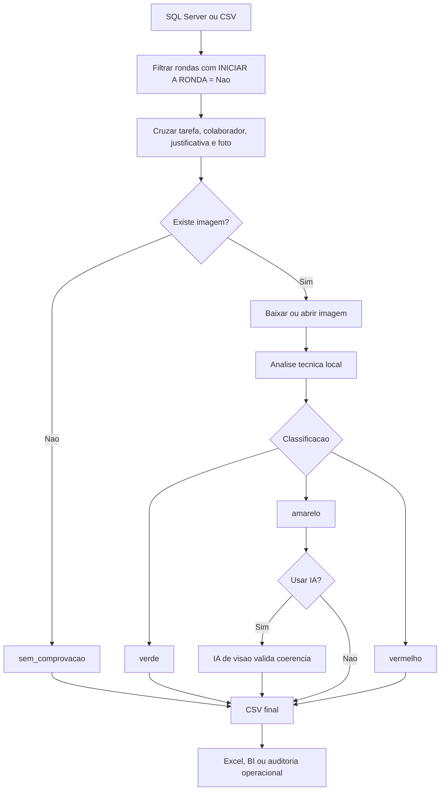

# Verificador-de-Rondas


> Projeto criado para a empresa **Grupo GPS** para auditar justificativas de rondas nao realizadas, detectando tentativas de burlar o processo com falta de comprovacao, fotos pretas, imagens invalidas ou evidencias suspeitas.

## O Problema

Em uma operacao de rondas, quando um colaborador responde **"Nao"** em **"INICIAR A RONDA?"**, ele precisa justificar e evidenciar o motivo. Na pratica, algumas justificativas podem esconder falhas no processo:

| Situacao encontrada | Risco operacional |
|---|---|
| Justificativa sem foto | Nao existe comprovacao visual |
| Foto preta ou escura | Pode indicar camera tampada, ambiente sem registro ou evidencia inutil |
| Imagem quebrada ou link invalido | A auditoria nao consegue validar o ocorrido |
| Foto sem relacao com a justificativa | A justificativa pode nao ser confiavel |
| Texto generico sem prova | A ronda deixa de parecer pendente, mesmo sem evidencia real |

O objetivo do projeto e criar uma camada automatizada de verificacao antes que uma justificativa seja aceita como confiavel.

## O Que Este Projeto Faz

O auditor transforma registros de ronda em uma triagem objetiva por risco:

- busca rondas justificadas direto do **SQL Server** ou de um **CSV**;
- identifica respostas em que **"INICIAR A RONDA?" = Nao**;
- cruza execucao, tarefa, justificativa e link da foto;
- baixa imagens enviadas como evidencia;
- detecta fotos pretas, escuras, quebradas, vazias ou suspeitas;
- separa casos sem imagem em um grupo proprio;
- gera um CSV final para Excel, BI ou relatorio;
- opcionalmente usa IA de visao para validar casos duvidosos;
- possui um agente separado para gerar XLSX com analise visual por IA.

## Visao Geral Do Fluxo

O fluxograma abaixo pode ser usado diretamente no GitHub, porque Markdown renderiza Mermaid.



## Grupos De Risco

| Grupo | Significado | Acao sugerida |
|---|---|---|
| `sem_comprovacao` | Existe justificativa, mas nao existe foto ou link de evidencia | Recusar por falta de comprovacao |
| `vermelho` | Evidencia claramente invalida: foto preta, imagem quebrada, link com erro ou imagem inutil | Recusar ou priorizar auditoria |
| `amarelo` | Evidencia suspeita, mas sem certeza suficiente para reprovar automaticamente | Revisar ou enviar para IA |
| `verde` | A imagem passou nos criterios tecnicos basicos | Baixo risco tecnico |

## Como O Auditor Decide

A classificacao local usa metricas tecnicas da imagem:

- brilho medio;
- variacao visual;
- percentual de pixels escuros;
- percentual de pixels quase pretos;
- nitidez aproximada;
- largura e altura da imagem;
- erro de download ou arquivo corrompido.

Essa etapa nao tenta "adivinhar" a verdade do acontecimento. Ela responde uma pergunta mais objetiva: **a evidencia visual e minimamente valida para ser analisada?**

## Tecnologias Utilizadas

| Area | Ferramenta |
|---|---|
| Linguagem | Python |
| Banco de dados | SQL Server |
| Conexao SQL | `pyodbc` |
| Processamento de imagem | `Pillow` |
| Entrada e saida | CSV e XLSX |
| Planilhas | Excel / BI |
| IA de visao | OpenAI ou Ollama Cloud |
| Configuracao | `.env` |
| Fluxograma | Mermaid no Markdown |

## IA Utilizada

O projeto tem dois modos de IA:

| Modo | Arquivo | Funcao |
|---|---|---|
| IA opcional no auditor | `ronda_auditor.py` | Apoia a classificacao de imagens suspeitas durante a geracao do CSV |
| Agente IA dedicado | `agente_IA/agente_analise_ia.py` | Le o CSV final, compara justificativa + imagem e gera um XLSX com analise detalhada |

Provedores suportados:

- **OpenAI**, usando `OPENAI_API_KEY` e `OPENAI_MODEL`;
- **Ollama Cloud**, usando `IA_PROVIDER=ollama` e `OLLAMA_MODEL`.

## Estrutura Do Projeto

```text
auditor_rondas/
  ronda_auditor.py
  requirements.txt
  README.md
  README_RONDAS.md
  README_COMPLETO.md
  exemplos/
    atividades_justificadas_exemplo.csv
    foto_exemplo.jpg
    foto_preta.jpg
  resultados/
    resultado_*.csv
    resultado_*_ia.xlsx
  agente_IA/
    agente_analise_ia.py
    requirements_agente_ia.txt
    README_AGENTE_IA.md
```

## Instalacao

Clone ou abra a pasta do projeto e instale as dependencias:

```powershell
cd C:\Users\marcos_barros\Downloads\auditor_rondas
python -m pip install -r requirements.txt
```

Para usar o agente IA separado:

```powershell
python -m pip install -r agente_IA\requirements_agente_ia.txt
```
## Como Rodar

### 1. Rodar usando dados reais do banco

```powershell
python ronda_auditor.py --data 2026-04-27 --saida resultados\resultado_2026-04-27.csv
```

### 2. Rodar usando um periodo

```powershell
python ronda_auditor.py --data-inicio 2026-04-20 --data-fim 2026-04-27 --saida resultados\resultado_periodo.csv
```

### 3. Rodar usando CSV

```powershell
python ronda_auditor.py --entrada exemplos\atividades_justificadas_exemplo.csv --saida resultados\resultado_auditoria.csv
```

### 4. Rodar com IA no auditor

Por padrao, a IA e chamada somente para casos `amarelo`.

```powershell
python ronda_auditor.py --data 2026-04-27 --saida resultados\resultado_ia.csv --usar-ia
```

Para enviar todos os grupos para IA:

```powershell
python ronda_auditor.py --data 2026-04-27 --saida resultados\resultado_ia_todos.csv --usar-ia --ia-em todos
```

### 5. Rodar o agente IA e gerar XLSX

```powershell
python agente_IA\agente_analise_ia.py --entrada resultados\resultado_2026-04-27.csv --saida resultados\resultado_2026-04-27_ia.xlsx
```

Testar somente as primeiras 5 linhas:

```powershell
python agente_IA\agente_analise_ia.py --entrada resultados\resultado_2026-04-27.csv --saida resultados\teste_ia.xlsx --limite 5
```

Forcar provedor Ollama:

```powershell
python agente_IA\agente_analise_ia.py --entrada resultados\resultado_2026-04-27.csv --saida resultados\resultado_ia.xlsx --provedor-ia ollama
```

## Filtro De Data

O parametro `--campo-periodo` define qual campo sera usado para filtrar o periodo no modo banco.

| Valor | Campo usado |
|---|---|
| `disponibilizacao` | Disponibilizacao da execucao |
| `tarefa_disponibilizacao` | Disponibilizacao da tarefa |
| `execucao` | Data em que a resposta foi registrada |
| `inicio` | Inicio planejado da tarefa |
| `termino` | Termino planejado da tarefa |
| `prazo` | Prazo da tarefa |
| `inicio_real` | Inicio real da tarefa |

Exemplo:

```powershell
python ronda_auditor.py --data 2026-04-27 --campo-periodo execucao --saida resultados\resultado_execucao.csv
```

## Colunas Do CSV Gerado

| Coluna | O que significa |
|---|---|
| `atividade_id` | Numero da execucao/ronda |
| `tarefa_id` | Identificador tecnico da tarefa |
| `colaborador` | Nome do colaborador que respondeu a ronda |
| `data` | Data usada no filtro do relatorio |
| `data_execucao_inicio` | Data/hora da resposta "INICIAR A RONDA? = Nao" |
| `execucao_disponibilizacao` | Disponibilizacao registrada na execucao |
| `tarefa_disponibilizacao` | Disponibilizacao registrada na tarefa |
| `tarefa_inicio` | Inicio planejado da tarefa |
| `tarefa_termino` | Termino planejado da tarefa |
| `tarefa_prazo` | Prazo da tarefa |
| `tarefa_nome` | Nome da tarefa ou plano de ronda |
| `checklist_nome` | Nome do checklist associado |
| `checklist_descricao` | Descricao do checklist |
| `justificativa` | Texto informado pelo colaborador |
| `image_url` | Link da foto/evidencia |
| `data_justificativa` | Data/hora em que a justificativa foi registrada |
| `grupo` | Classificacao final: `sem_comprovacao`, `vermelho`, `amarelo` ou `verde` |
| `confianca` | Confianca da classificacao final, de `0.00` a `1.00` |
| `motivo` | Explicacao curta da decisao |
| `grupo_local` | Classificacao feita pelas regras tecnicas locais |
| `confianca_local` | Confianca da analise local |
| `motivo_local` | Motivo da analise local |
| `brilho_medio` | Media de brilho da imagem |
| `variacao_visual` | Variacao dos pixels; imagens lisas tendem a ter valor baixo |
| `pixels_escuros` | Percentual de pixels escuros |
| `pixels_quase_pretos` | Percentual de pixels quase pretos |
| `nitidez_aproximada` | Indicador simples de detalhes e bordas |
| `largura` | Largura da imagem |
| `altura` | Altura da imagem |
| `grupo_ia` | Classificacao retornada pela IA, quando usada |
| `confianca_ia` | Confianca da IA |
| `motivo_ia` | Explicacao da IA |
| `erro_ia` | Erro tecnico da IA, se ocorrer |

## Colunas Do XLSX Gerado Pelo Agente IA

| Coluna | O que significa |
|---|---|
| `analisada por IA` | Resultado final da IA: `aprovada`, `reprovada`, `duvidosa`, `sem imagem` ou `erro` |
| `grupo_analise_ia` | Grupo retornado pela analise da IA |
| `confianca_analise_ia` | Confianca da IA entre `0.00` e `1.00` |
| `motivo_analise_ia` | Motivo da decisao |
| `descricao_visual_ia` | Descricao do que a IA enxergou na imagem |
| `acao_sugerida_ia` | Sugestao: aceitar, revisar ou recusar |
| `erro_analise_ia` | Erro tecnico, quando houver |

## Entrada CSV Esperada

Para testes ou homologacao, o CSV pode ter pelo menos:

```csv
atividade_id,colaborador,data,justificativa,image_url
```

Tambem e aceito `image_path` quando a imagem estiver salva localmente:

```csv
atividade_id,colaborador,data,justificativa,image_path
123,Joao,2026-04-28,"Portao bloqueado",C:\fotos\ronda_123.jpg
```

## Rotina Recomendada De Auditoria

1. Rode o auditor para a data ou periodo desejado.
2. Abra o CSV gerado em `resultados/`.
3. Filtre primeiro `sem_comprovacao`.
4. Depois filtre `vermelho`.
5. Envie `amarelo` para revisao ou IA.
6. Use `verde` como baixo risco tecnico.

## Resumo Executivo

Este projeto nao substitui a auditoria humana: ele reduz o ruido. Em vez de revisar todas as justificativas manualmente, a operacao passa a receber uma fila priorizada, separando o que esta sem comprovacao, o que parece burla, o que e duvidoso e o que passou nos criterios basicos de evidencia.
